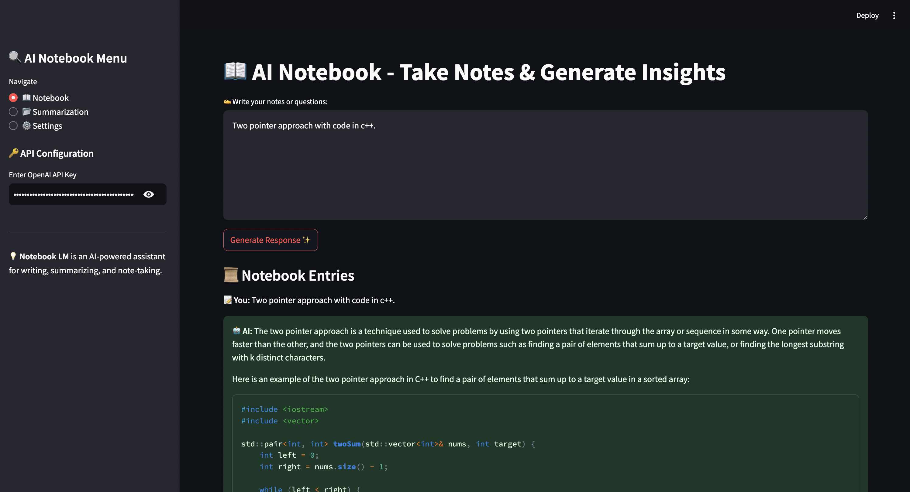

# 📓 Notebook AI App

## 🚀 Overview
Notebook AI is a Streamlit-based web app that allows users to **upload documents**, **summarize content**, **take notes**, and **ask follow-up questions** using LangChain and OpenAI's GPT models. It provides an interactive interface for **quick summarization** and **contextual Q&A** based on uploaded documents.

## 🎯 Features
- 📂 **File Upload**: Supports text and PDF file uploads for summarization.
- ✍️ **Note-Taking**: Allows users to jot down important points.
- 📝 **Summarization**: Generates concise summaries of uploaded documents.
- ❓ **Ask Questions**: Users can query the document for additional context or examples.
- 📌 **Sidebar Navigation**: Provides easy access to different functionalities.

## 🏗️ Tech Stack
- **Frontend**: Streamlit
- **Backend**: LangChain, OpenAI API
- **Storage**: Local memory (optional Firestore integration)

## 🔧 Installation & Setup
1. **Clone the repository**:
   ```bash
   git clone https://github.com/kkverma/NotebookAI
   cd NotebookAI
   ```

2. **Create a virtual environment and install dependencies**:
   ```bash
   python -m venv venv
   source venv/bin/activate  # On Windows: venv\Scripts\activate
   pip install -r requirements.txt
   ```

3. **Run the Streamlit app**:
   ```bash
   streamlit run app.py
   ```

## 🔑 API Key Setup
Make sure you have an **OpenAI API key**. You can enter it in the sidebar of the app.

## 📸 Screenshots


## 📜 License
MIT License

## 📬 Contact
For any queries or contributions, reach out to **[https://github.com/kkverma](https://github.com/kkverma)**.

